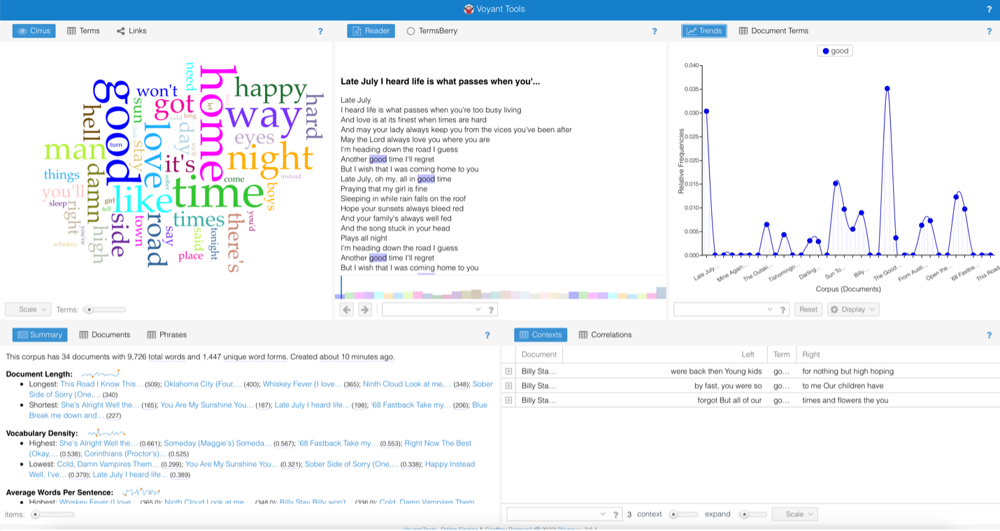

## Source

https://voyant-tools.org/docs/#!/guide/start

## Evaluation

Voyant Tool is a “web based text reading and analysis environment.” The program allows users to upload text documents to be read, analyzed, and produce visualization tools. Voyant has twenty-four unique tools that can be applied to any corpus. It accepts texts or collections of text in plain text, HTML, XML, PDF, RTF, and MS Word. Voyant is very versatile in that it can accept so many file types, but also in the sheer number of outputs and different ways it allows users to analyze their inputs. 

Voyant’s biggest downfall, however, seems to be its user friendliness. While it’s easy to upload a document, it was quite hard to manipulate it thereafter. To test the program, I uploaded a word document containing the lyrics of songs to a Zach Bryan album. It advertises that it can auto detect different chapters or sections of text, but after trying over and over it still wouldn’t. This made it so I was analyzing the album as a whole, making many of Voyant’s features useless without the chapter or song division. The only way I was able to get the program to recognize different songs as part of the whole album was to upload them one by why which not only took a long time, but after adding 34 documents, Voyant’s program began to lag. Additionally, its autodetection of stop words wasn’t great. However, this was an easy fix to do manually, and it might have just been because I was using lyrics instead of a normal document. 

Overall, I still think Voyant Tools is an excellent digital humanities project as it allows users to make compelling visualizations very quickly and easily. With a little more development to fix some of the issues I’ve outlined, it will be become an even better tool for humanists to use to analyze large corpuses of text quickly.  