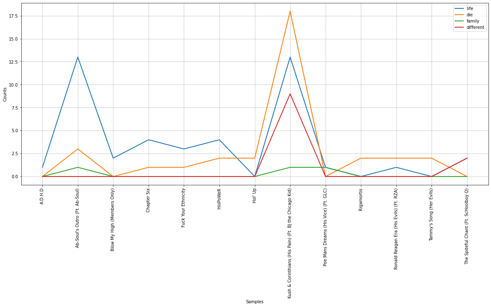
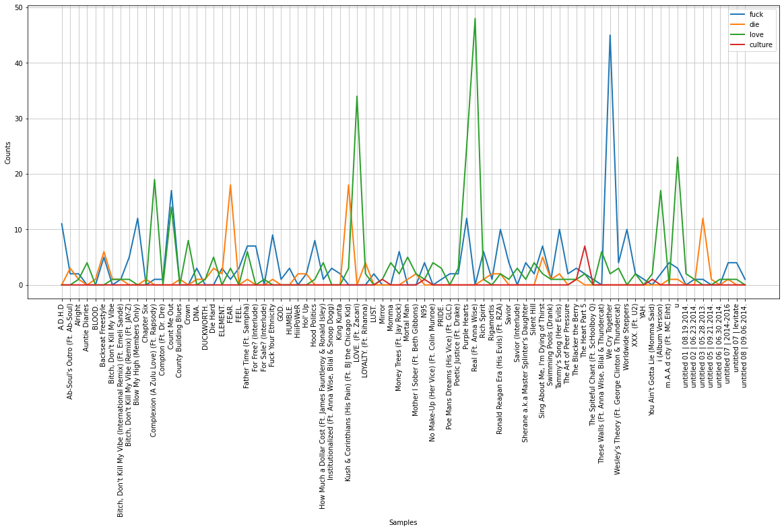
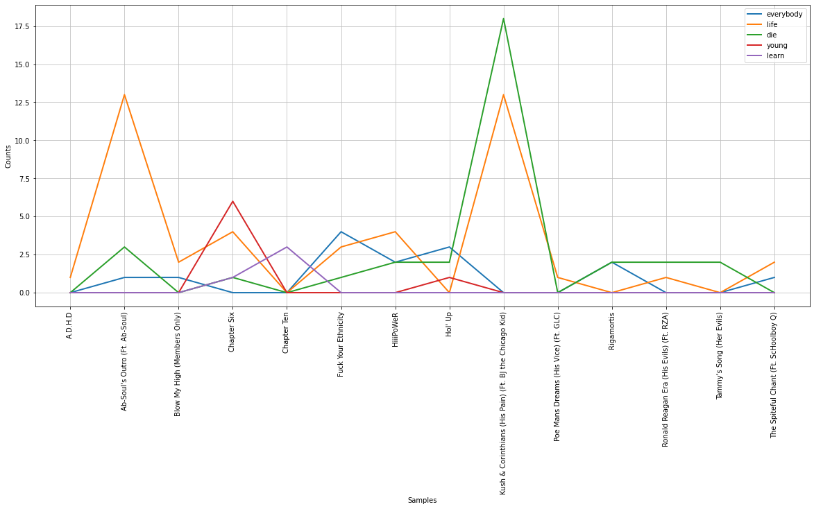
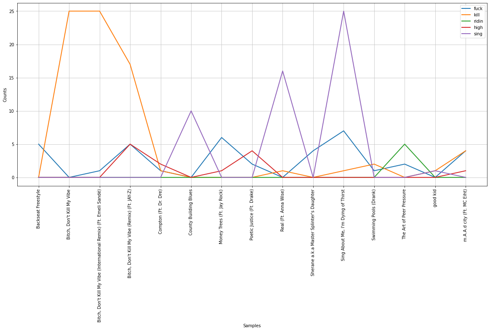
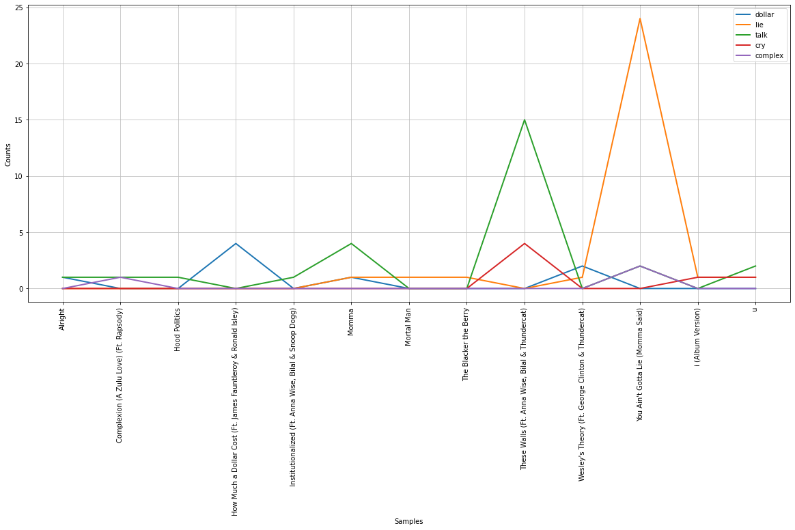
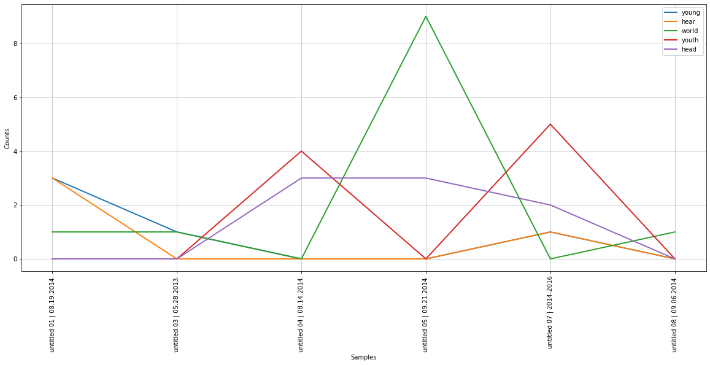
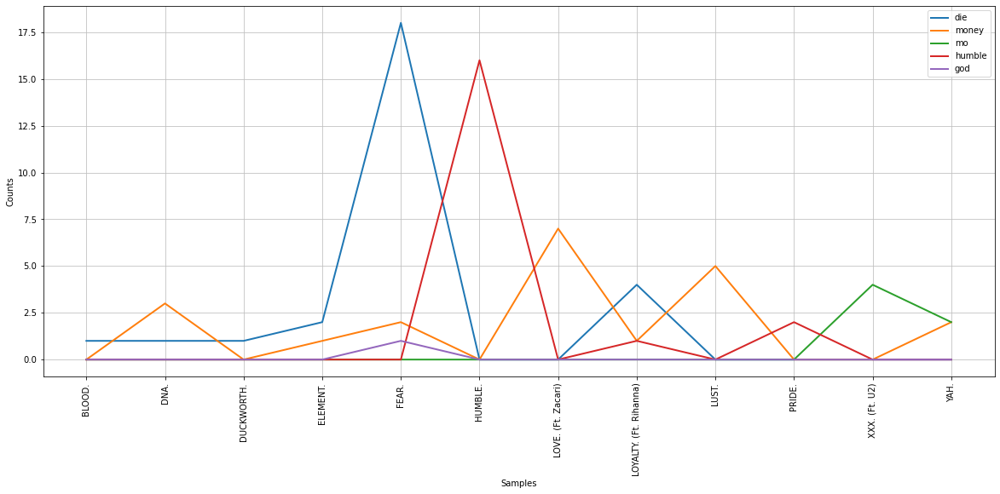
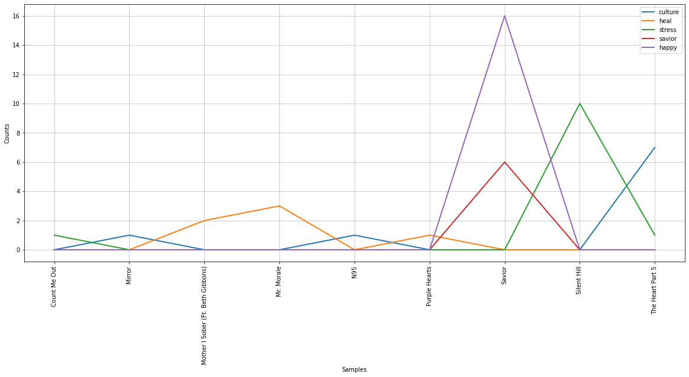
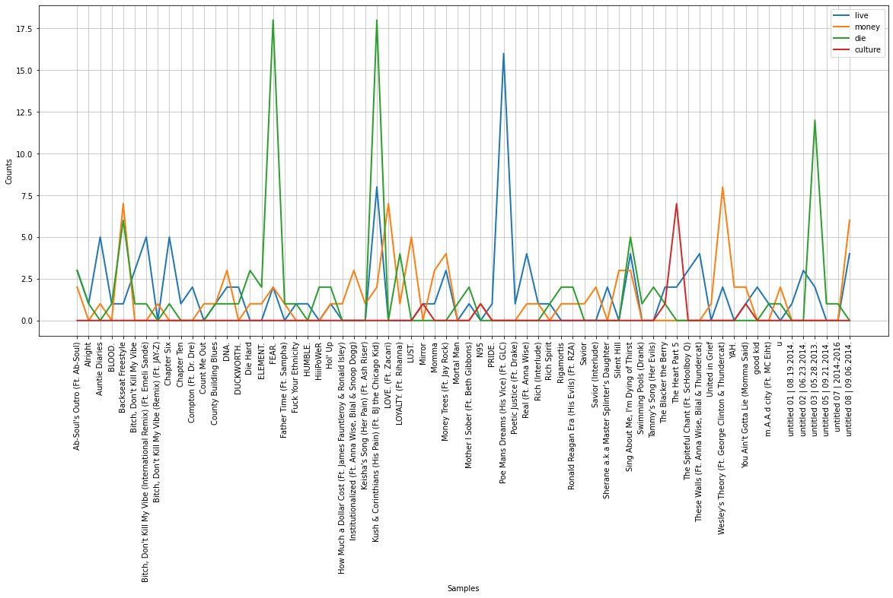

# Analyzing Kendrick Lamar's Discogrpahy

# Data Preparation


```python
# 1 
# install packages
!pip install wget
```

    Requirement already satisfied: wget in /Users/gillislinde/opt/anaconda3/lib/python3.9/site-packages (3.2)


```python
# 2
# imports
import pandas as pd
import wget
import os
import re
import spacy
import json  # you might want to use this after all, see below -ms
from sklearn.feature_extraction.text import TfidfVectorizer
import nltk
import matplotlib.pyplot as plt
```


```python
# 3
# downloading lyrics app
if not os.path.isfile('get_lyrics.py'): 
    wget.download('https://raw.githubusercontent.com/pnadelofficial/datasets/main/lyrics_app/get_lyrics.py')
    
from get_lyrics import getSongs
```

    100% [............................................................] 1759 / 1759


```python
# 4 
! python -m spacy download en_core_web_sm
```

    Collecting en-core-web-sm==3.4.1
      Downloading https://github.com/explosion/spacy-models/releases/download/en_core_web_sm-3.4.1/en_core_web_sm-3.4.1-py3-none-any.whl (12.8 MB)
         |████████████████████████████████| 12.8 MB 2.8 MB/s eta 0:00:01
    [?25hRequirement already satisfied: spacy<3.5.0,>=3.4.0 in /Users/gillislinde/opt/anaconda3/lib/python3.9/site-packages (from en-core-web-sm==3.4.1) (3.4.2)
    Requirement already satisfied: murmurhash<1.1.0,>=0.28.0 in /Users/gillislinde/opt/anaconda3/lib/python3.9/site-packages (from spacy<3.5.0,>=3.4.0->en-core-web-sm==3.4.1) (1.0.9)
    Requirement already satisfied: typer<0.5.0,>=0.3.0 in /Users/gillislinde/opt/anaconda3/lib/python3.9/site-packages (from spacy<3.5.0,>=3.4.0->en-core-web-sm==3.4.1) (0.4.2)
    Requirement already satisfied: cymem<2.1.0,>=2.0.2 in /Users/gillislinde/opt/anaconda3/lib/python3.9/site-packages (from spacy<3.5.0,>=3.4.0->en-core-web-sm==3.4.1) (2.0.7)
    Requirement already satisfied: pathy>=0.3.5 in /Users/gillislinde/opt/anaconda3/lib/python3.9/site-packages (from spacy<3.5.0,>=3.4.0->en-core-web-sm==3.4.1) (0.6.2)
    Requirement already satisfied: pydantic!=1.8,!=1.8.1,<1.11.0,>=1.7.4 in /Users/gillislinde/opt/anaconda3/lib/python3.9/site-packages (from spacy<3.5.0,>=3.4.0->en-core-web-sm==3.4.1) (1.10.2)
    Requirement already satisfied: spacy-loggers<2.0.0,>=1.0.0 in /Users/gillislinde/opt/anaconda3/lib/python3.9/site-packages (from spacy<3.5.0,>=3.4.0->en-core-web-sm==3.4.1) (1.0.3)
    Requirement already satisfied: requests<3.0.0,>=2.13.0 in /Users/gillislinde/opt/anaconda3/lib/python3.9/site-packages (from spacy<3.5.0,>=3.4.0->en-core-web-sm==3.4.1) (2.27.1)
    Requirement already satisfied: spacy-legacy<3.1.0,>=3.0.10 in /Users/gillislinde/opt/anaconda3/lib/python3.9/site-packages (from spacy<3.5.0,>=3.4.0->en-core-web-sm==3.4.1) (3.0.10)
    Requirement already satisfied: preshed<3.1.0,>=3.0.2 in /Users/gillislinde/opt/anaconda3/lib/python3.9/site-packages (from spacy<3.5.0,>=3.4.0->en-core-web-sm==3.4.1) (3.0.8)
    Requirement already satisfied: thinc<8.2.0,>=8.1.0 in /Users/gillislinde/opt/anaconda3/lib/python3.9/site-packages (from spacy<3.5.0,>=3.4.0->en-core-web-sm==3.4.1) (8.1.5)
    Requirement already satisfied: srsly<3.0.0,>=2.4.3 in /Users/gillislinde/opt/anaconda3/lib/python3.9/site-packages (from spacy<3.5.0,>=3.4.0->en-core-web-sm==3.4.1) (2.4.5)
    Requirement already satisfied: wasabi<1.1.0,>=0.9.1 in /Users/gillislinde/opt/anaconda3/lib/python3.9/site-packages (from spacy<3.5.0,>=3.4.0->en-core-web-sm==3.4.1) (0.10.1)
    Requirement already satisfied: jinja2 in /Users/gillislinde/opt/anaconda3/lib/python3.9/site-packages (from spacy<3.5.0,>=3.4.0->en-core-web-sm==3.4.1) (2.11.3)
    Requirement already satisfied: packaging>=20.0 in /Users/gillislinde/opt/anaconda3/lib/python3.9/site-packages (from spacy<3.5.0,>=3.4.0->en-core-web-sm==3.4.1) (21.3)
    Requirement already satisfied: catalogue<2.1.0,>=2.0.6 in /Users/gillislinde/opt/anaconda3/lib/python3.9/site-packages (from spacy<3.5.0,>=3.4.0->en-core-web-sm==3.4.1) (2.0.8)
    Requirement already satisfied: setuptools in /Users/gillislinde/opt/anaconda3/lib/python3.9/site-packages (from spacy<3.5.0,>=3.4.0->en-core-web-sm==3.4.1) (61.2.0)
    Requirement already satisfied: langcodes<4.0.0,>=3.2.0 in /Users/gillislinde/opt/anaconda3/lib/python3.9/site-packages (from spacy<3.5.0,>=3.4.0->en-core-web-sm==3.4.1) (3.3.0)
    Requirement already satisfied: tqdm<5.0.0,>=4.38.0 in /Users/gillislinde/opt/anaconda3/lib/python3.9/site-packages (from spacy<3.5.0,>=3.4.0->en-core-web-sm==3.4.1) (4.64.0)
    Requirement already satisfied: numpy>=1.15.0 in /Users/gillislinde/opt/anaconda3/lib/python3.9/site-packages (from spacy<3.5.0,>=3.4.0->en-core-web-sm==3.4.1) (1.21.5)
    Requirement already satisfied: pyparsing!=3.0.5,>=2.0.2 in /Users/gillislinde/opt/anaconda3/lib/python3.9/site-packages (from packaging>=20.0->spacy<3.5.0,>=3.4.0->en-core-web-sm==3.4.1) (3.0.4)
    Requirement already satisfied: smart-open<6.0.0,>=5.2.1 in /Users/gillislinde/opt/anaconda3/lib/python3.9/site-packages (from pathy>=0.3.5->spacy<3.5.0,>=3.4.0->en-core-web-sm==3.4.1) (5.2.1)
    Requirement already satisfied: typing-extensions>=4.1.0 in /Users/gillislinde/opt/anaconda3/lib/python3.9/site-packages (from pydantic!=1.8,!=1.8.1,<1.11.0,>=1.7.4->spacy<3.5.0,>=3.4.0->en-core-web-sm==3.4.1) (4.1.1)
    Requirement already satisfied: urllib3<1.27,>=1.21.1 in /Users/gillislinde/opt/anaconda3/lib/python3.9/site-packages (from requests<3.0.0,>=2.13.0->spacy<3.5.0,>=3.4.0->en-core-web-sm==3.4.1) (1.26.9)
    Requirement already satisfied: charset-normalizer~=2.0.0 in /Users/gillislinde/opt/anaconda3/lib/python3.9/site-packages (from requests<3.0.0,>=2.13.0->spacy<3.5.0,>=3.4.0->en-core-web-sm==3.4.1) (2.0.4)
    Requirement already satisfied: idna<4,>=2.5 in /Users/gillislinde/opt/anaconda3/lib/python3.9/site-packages (from requests<3.0.0,>=2.13.0->spacy<3.5.0,>=3.4.0->en-core-web-sm==3.4.1) (3.3)
    Requirement already satisfied: certifi>=2017.4.17 in /Users/gillislinde/opt/anaconda3/lib/python3.9/site-packages (from requests<3.0.0,>=2.13.0->spacy<3.5.0,>=3.4.0->en-core-web-sm==3.4.1) (2021.10.8)
    Requirement already satisfied: blis<0.8.0,>=0.7.8 in /Users/gillislinde/opt/anaconda3/lib/python3.9/site-packages (from thinc<8.2.0,>=8.1.0->spacy<3.5.0,>=3.4.0->en-core-web-sm==3.4.1) (0.7.9)
    Requirement already satisfied: confection<1.0.0,>=0.0.1 in /Users/gillislinde/opt/anaconda3/lib/python3.9/site-packages (from thinc<8.2.0,>=8.1.0->spacy<3.5.0,>=3.4.0->en-core-web-sm==3.4.1) (0.0.3)
    Requirement already satisfied: click<9.0.0,>=7.1.1 in /Users/gillislinde/opt/anaconda3/lib/python3.9/site-packages (from typer<0.5.0,>=0.3.0->spacy<3.5.0,>=3.4.0->en-core-web-sm==3.4.1) (8.0.4)
    Requirement already satisfied: MarkupSafe>=0.23 in /Users/gillislinde/opt/anaconda3/lib/python3.9/site-packages (from jinja2->spacy<3.5.0,>=3.4.0->en-core-web-sm==3.4.1) (2.0.1)
    ✔ Download and installation successful
    You can now load the package via spacy.load('en_core_web_sm')


```python
# 5
# creating function to clean lyrics
def clean_lyrics(lyrics):
    clean = re.sub('(\[.*\])','',lyrics).split('\n')[1:]
    clean = ' '.join(clean)
    clean = re.sub('\d+Embed','',clean)
    clean = clean.replace('See Kendrick Lamar LiveGet tickets as low as $181','')  # remove ad
    return clean.strip() # strip takes out any leading or ending spaces

nlp = spacy.load("en_core_web_sm")
def get_lemmas(text):
    doc = nlp(text)
    tokens = [token for token in doc if token.is_alpha]
    tokens = [token for token in tokens if not token.is_stop]
    lemmas = [token.lemma_ for token in tokens]
    return lemmas

# combine above two functions for later use
def process_text(lyrics):
    cleaned_lyrics = clean_lyrics(lyrics)
    lemmas = get_lemmas(cleaned_lyrics)
    return lemmas
```


```python
# 6
# gathering all kendrick studio albums
album_names = [
    r'Section.80',
    r'good kid m.A.A.d city',
    r"To Pimp A Butterly",
    r'untitled unmastered.',
    r'DAMN.',
    r'Mr. Morale The Big Steppers',
]
```


```python
# 7
# downloading lyrics
for album_name in album_names:
    getSongs('Kendrick Lamar', album_name)
```

    Searching for "Section.80" by Kendrick Lamar...
    Wrote Lyrics_Section.80.json.
    Data saved
    Data loaded
    Searching for "good kid m.A.A.d city" by Kendrick Lamar...
    Wrote Lyrics_goodkidm.A.A.dcity.json.
    Data saved
    Data loaded
    Searching for "To Pimp A Butterly" by Kendrick Lamar...
    Wrote Lyrics_ToPimpAButterly.json.
    Data saved
    Data loaded
    Searching for "untitled unmastered." by Kendrick Lamar...
    Wrote Lyrics_untitledunmastered..json.
    Data saved
    Data loaded
    Searching for "DAMN." by Kendrick Lamar...
    Wrote Lyrics_DAMN..json.
    Data saved
    Data loaded
    Searching for "Mr. Morale The Big Steppers" by Kendrick Lamar...
    Wrote Lyrics_Mr.MoraleTheBigSteppers.json.
    Data saved
    Data loaded


```python
# 8
# creatiung empty lists to populate by going through each JSON file
album_titles = []
years = []
song_titles = []
song_lyrics = []
for file_name in os.listdir():        # iterate through all files in current directory
    if file_name.endswith('.json'):   # isloate json files 
        with open(file_name) as f:
            data = json.load(f)
        album_title = data['full_title']
        album_title = album_title.replace(' by Kendrick Lamar', '')  
        album_year = data['release_date_components']['year']
        for track in data['tracks']:
            album_titles.append(album_title)
            years.append(album_year)
            song_title = track['song']['title_with_featured']
            song_titles.append(song_title)
            song_lyric = track['song']['lyrics']
            song_lyrics.append(song_lyric)
            
# make df based on the lists we just populated
df = pd.DataFrame(list(zip(album_titles, years, song_titles, song_lyrics)),
                  columns =['album_title', 'year', 'song_title', 'raw_lyrics'])

# cleaning the lyrics
df['processed_lyrics_list'] = df['raw_lyrics'].apply(process_text)
df['processed_lyrics_string'] = df['processed_lyrics_list'].apply(' '.join)

# order by release date
# df = df.sort_values(by='year', ascending=True)

df.head()
```


<div>
<style scoped>
    .dataframe tbody tr th:only-of-type {
        vertical-align: middle;
    }

    .dataframe tbody tr th {
        vertical-align: top;
    }

    .dataframe thead th {
        text-align: right;
    }
</style>
<table border="1" class="dataframe">
  <thead>
    <tr style="text-align: right;">
      <th></th>
      <th>album_title</th>
      <th>year</th>
      <th>song_title</th>
      <th>raw_lyrics</th>
      <th>processed_lyrics_list</th>
      <th>processed_lyrics_string</th>
    </tr>
  </thead>
  <tbody>
    <tr>
      <th>0</th>
      <td>Mr. Morale &amp; The Big Steppers</td>
      <td>2022</td>
      <td>United in Grief</td>
      <td>TranslationsУкраїнськаEspañolРусскийEnglishEng...</td>
      <td>[hope, find, peace, mind, lifetime, tell, tell...</td>
      <td>hope find peace mind lifetime tell tell tell t...</td>
    </tr>
    <tr>
      <th>1</th>
      <td>Mr. Morale &amp; The Big Steppers</td>
      <td>2022</td>
      <td>N95</td>
      <td>TranslationsУкраїнськаEspañolРусскийPortuguêsI...</td>
      <td>[hello, new, world, boy, girl, get, true, stor...</td>
      <td>hello new world boy girl get true story tell o...</td>
    </tr>
    <tr>
      <th>2</th>
      <td>Mr. Morale &amp; The Big Steppers</td>
      <td>2022</td>
      <td>Worldwide Steppers</td>
      <td>TranslationsEnglishEnglishPortuguêsEnglishहिन्...</td>
      <td>[Kodak, Black, Oklama, Eckhart, Tolle, big, st...</td>
      <td>Kodak Black Oklama Eckhart Tolle big stepper k...</td>
    </tr>
    <tr>
      <th>3</th>
      <td>Mr. Morale &amp; The Big Steppers</td>
      <td>2022</td>
      <td>Die Hard</td>
      <td>TranslationsTürkçeEspañolPortuguêsItalianoहिन्...</td>
      <td>[pop, pain, away, slide, pain, away, pop, pain...</td>
      <td>pop pain away slide pain away pop pain away sl...</td>
    </tr>
    <tr>
      <th>4</th>
      <td>Mr. Morale &amp; The Big Steppers</td>
      <td>2022</td>
      <td>Father Time (Ft. Sampha)</td>
      <td>TranslationsEnglishPortuguêsItalianoहिन्दीFran...</td>
      <td>[need, therapy, real, nigga, need, therapy, fu...</td>
      <td>need therapy real nigga need therapy fuck talk...</td>
    </tr>
  </tbody>
</table>
</div>


# TF-IDF Set-Up


```python
# 9
# print album titles for reference
print(set(album_titles))
```

    {'untitled unmastered.', 'To Pimp a Butterfly', 'DAMN.', 'Mr. Morale & The Big Steppers', 'Section.80', 'good kid, m.A.A.d city'}


```python
# 10
# starting with section.80
section80_df = df[df['album_title'] == 'Section.80']
processed_lyrics = section80_df['processed_lyrics_string'].tolist()
song_titles = section80_df['song_title'].tolist()
```


```python
# 11
# transform corpus into a matrix of word counts
vectorizer = TfidfVectorizer(max_df=.65, min_df=1, stop_words= None, # no stop words for now
                             use_idf= True, norm=None)
transformed_lyrics = vectorizer.fit_transform(processed_lyrics)
transformed_lyrics_as_array = transformed_lyrics.toarray()
```


```python
# 12
# geting top words
key_words_by_song = {}
for song, song_title in zip(transformed_lyrics_as_array, song_titles):
    tf_idf_tuples = list(zip(vectorizer.get_feature_names(), song))
    sorted_tf_idf_tuples = sorted(tf_idf_tuples, key= lambda x: x[1], reverse=True)
    k = song_title
    v = sorted_tf_idf_tuples[:10]
    key_words_by_song[k] = v
```

    /Users/gillislinde/opt/anaconda3/lib/python3.9/site-packages/sklearn/utils/deprecation.py:87: FutureWarning: Function get_feature_names is deprecated; get_feature_names is deprecated in 1.0 and will be removed in 1.2. Please use get_feature_names_out instead.
      warnings.warn(msg, category=FutureWarning)


```python
# 13
# print top 5 words per song
for k, v in key_words_by_song.items():
    result = k + ' => ' + v[0][0] + ', ' + v[1][0] + ', ' + v[2][0] + ', ' + v[3][0] + ', ' + v[4][0]
    print(result)
```

    Fuck Your Ethnicity => fuck, ethnicity, mmm, asian, hispanic
    Hol' Up => hol, poppin, watchin, bitch, yeah
    A.D.H.D => woah, fuck, adhd, limit, age
    No Make-Up (Her Vice) (Ft. Colin Munroe) => makeup, today, fine, girl, lip
    Tammy's Song (Her Evils) => fuck, tired, girl, niggas, middle
    Chapter Six => young, reckless, ridin, wild, boy
    Ronald Reagan Era (His Evils) (Ft. RZA) => woop, di, woah, compton, fuck
    Poe Mans Dreams (His Vice) (Ft. GLC) => good, eat, smoke, live, talk
    The Spiteful Chant (Ft. ScHoolboy Q) => hoe, suck, go, dick, act
    Chapter Ten => learn, time, well, belligerent, citizen
    Keisha's Song (Her Pain) (Ft. Ash Riser) => park, beach, fancy, flashy, car
    Rigamortis => amen, dead, yup, basket, breathe
    Kush & Corinthians (His Pain) (Ft. BJ the Chicago Kid) => da, oh, die, different, corinthians
    Blow My High (Members Only) => aaliyah, counterfeit, fuck, business, niggas
    Ab-Soul's Outro (Ft. Ab-Soul) => jam, traffic, life, gon, fire
    HiiiPoWeR => hiiipower, na, frightenin, system, fuckin


```python
# 14
! pip install nltk
```

    Requirement already satisfied: nltk in /Users/gillislinde/opt/anaconda3/lib/python3.9/site-packages (3.7)
    Requirement already satisfied: joblib in /Users/gillislinde/opt/anaconda3/lib/python3.9/site-packages (from nltk) (1.1.0)
    Requirement already satisfied: regex>=2021.8.3 in /Users/gillislinde/opt/anaconda3/lib/python3.9/site-packages (from nltk) (2022.3.15)
    Requirement already satisfied: tqdm in /Users/gillislinde/opt/anaconda3/lib/python3.9/site-packages (from nltk) (4.64.0)
    Requirement already satisfied: click in /Users/gillislinde/opt/anaconda3/lib/python3.9/site-packages (from nltk) (8.0.4)


```python
# 15
# Re-organize data for nltk cfd to process
album = {}
processed_lyrics_tokens = section80_df['processed_lyrics_list'].tolist() 
for song_title, lemmas in zip(song_titles, processed_lyrics_tokens):
    album[song_title] = lemmas
```


```python
# 16
# conditional frequency distribution
key_words = ['die', 'family', 'different', 'life']  # <-- example... instert token(s) to explore (lowercase)
cfd = nltk.ConditionalFreqDist(
    (key_word, song_title)
    for song_title in album.keys()
    for word in album[song_title]
    for key_word in key_words
    if word == key_word
)
# display plot
plt.figure(figsize=(20, 8))  
cfd.plot()
```


    

    


    <AxesSubplot:xlabel='Samples', ylabel='Counts'>


```python
# 17
# use Section.80 example to make printing top five words per album a function with an album as the input
def album_key_words(album):
    album_df = df[df['album_title'] == album]
    processed_lyrics = album_df['processed_lyrics_string'].tolist()
    song_titles = album_df['song_title'].tolist()
    stop_words = ['yup','da','oh','fuck','na','di','mmm','hol','yeah','woah','woop', 'woah', 'uh', 'huh', 'ah', 'ooh', 'da', 'ah', 'ann', 'yeah', 'to', 'ayy', 'huh', 'aha', 'ya', 'wah', 'duh', 'dun', 'hah', 'brat', 'ha', 'hol', 'ai', 'oh', 'to', 'po', 'cah', 'aye', 'doo', 'iv', 'blah', 'doot', 'hol', 'na', 'di', 'ism', 'loc', 'ps', 'nah', 'yo', 'hey', 'ohh', 'ohhhh', 'brrt', 'ugh']
    vectorizer = TfidfVectorizer(max_df=.65, min_df=1, stop_words= stop_words,use_idf= True, norm=None)
    transformed_lyrics = vectorizer.fit_transform(processed_lyrics)
    transformed_lyrics_as_array = transformed_lyrics.toarray()
    key_words_by_song = {}
    for song, song_title in zip(transformed_lyrics_as_array, song_titles):
        tf_idf_tuples = list(zip(vectorizer.get_feature_names(), song))
        sorted_tf_idf_tuples = sorted(tf_idf_tuples, key= lambda x: x[1], reverse=True)
        k = song_title
        v = sorted_tf_idf_tuples[:10]  # only getting the top ten
        key_words_by_song[k] = v  
    for k, v in key_words_by_song.items():
        result = k + ' => ' + v[0][0] + ', ' + v[1][0] + ', ' + v[2][0] + ', ' + v[3][0] + ', ' + v[4][0]
        print(result)
```


```python
# 18
# use example to make the plot a function with an album and five words as inputs
def plot_key_words(album, word_1, word_2, word_3, word_4, word_5):
    album_dict = {}
    album_df = df[df['album_title'] == album]
    processed_lyrics_tokens = album_df['processed_lyrics_list'].tolist()
    song_titles = album_df['song_title'].tolist()
    for song_title, lemmas in zip(song_titles, processed_lyrics_tokens):
        album_dict[song_title] = lemmas
        
    key_words = [word_1, word_2, word_3, word_4, word_5]
    cfd = nltk.ConditionalFreqDist(
        (key_word, song_title)
        for song_title in album_dict.keys()
        for word in album_dict[song_title]
        for key_word in key_words
        if word == key_word
    )
    # display plot
    plt.figure(figsize=(20, 8))  # this expands the plot to make it more readable
    cfd.plot()
```


```python
# 17
# sort the data frame created previously 
sorted_df = df.sort_values(by='year', ascending=True)
```


```python
# 18
song_title_list = sorted_df['song_title'].tolist()
song_tokens_string = sorted_df['processed_lyrics_string'].tolist()
song_tokens_list = sorted_df['processed_lyrics_list'].tolist()
```


```python
# 19
# new dictionary: keys are songs, values are dictionary where one key is list and another is string
total_song_dict = {}
for title, string_, list_ in zip(song_title_list, song_tokens_string, song_tokens_list):
    total_song_dict[title] = {}
    total_song_dict[title]['as_string'] = string_
    total_song_dict[title]['as_list'] = list_
```


```python
# 20
# print number of songs in discography
len(total_song_dict.keys())
```


    89


```python
# 21
# print top five words per songs, w.r.t. full discography tf-idf
# adding stop words
stop_words = ['yup','da','oh','fuck','na','di','mmm','hol','yeah','woah','woop', 'woah', 'uh', 'huh', 'ah', 'ooh', 'da', 'ah', 'ann', 'yeah', 'to', 'ayy', 'huh', 'aha', 'ya', 'wah', 'duh', 'dun', 'hah', 'brat', 'ha', 'hol', 'ai', 'oh', 'to', 'po', 'cah', 'aye', 'doo', 'iv', 'blah', 'doot', 'hol', 'na', 'di', 'ism', 'loc', 'ps', 'nah', 'yo', 'hey', 'ohh', 'ohhhh', 'brrt', 'ugh']
vectorizer = TfidfVectorizer(max_df=.65, min_df=1, stop_words= stop_words,use_idf= True, norm=None)

transformed_lyrics = vectorizer.fit_transform(song_tokens_string)

transformed_lyrics_as_array = transformed_lyrics.toarray()
key_words_by_song = {}
for song, song_title in zip(transformed_lyrics_as_array, song_title_list):
    tf_idf_tuples = list(zip(vectorizer.get_feature_names(), song))
    sorted_tf_idf_tuples = sorted(tf_idf_tuples, key= lambda x: x[1], reverse=True)
    k = song_title
    v = sorted_tf_idf_tuples[:10]
    key_words_by_song[k] = v  
for k, v in key_words_by_song.items():
    result = k + ' => ' + v[0][0] + ', ' + v[1][0] + ', ' + v[2][0] + ', ' + v[3][0] + ', ' + v[4][0]
    print(result)
```

    The Spiteful Chant (Ft. ScHoolboy Q) => hoe, suck, dick, go, big
    Chapter Ten => learn, citizen, feminine, immigrant, masculine
    Keisha's Song (Her Pain) (Ft. Ash Riser) => fancy, beach, flashy, boulevard, flagging
    Rigamortis => amen, dead, dragon, egg, manson
    Kush & Corinthians (His Pain) (Ft. BJ the Chicago Kid) => die, corinthians, seat, different, ride
    Blow My High (Members Only) => aaliyah, counterfeit, business, niggas, yep
    HiiiPoWeR => hiiipower, system, frightenin, dish, hieroglyph
    Ab-Soul's Outro (Ft. Ab-Soul) => jam, traffic, fire, enlighten, ready
    Chapter Six => reckless, ridin, wild, young, boy
    Ronald Reagan Era (His Evils) (Ft. RZA) => dungeons, california, compton, fight, bompton
    Fuck Your Ethnicity => ethnicity, hispanic, asian, goddammit, knock
    Tammy's Song (Her Evils) => tired, middle, girl, niggas, sick
    No Make-Up (Her Vice) (Ft. Colin Munroe) => makeup, today, lip, fine, drunk
    A.D.H.D => adhd, limit, doobie, age, half
    Poe Mans Dreams (His Vice) (Ft. GLC) => good, smoke, eat, live, talk
    Hol' Up => poppin, stewardess, big, compliment, eighty
    Real (Ft. Anna Wise) => real, love, sing, song, plan
    Compton (Ft. Dr. Dre) => compton, city, dre, blaze, flat
    Bitch, Don't Kill My Vibe (Remix) (Ft. JAY-Z) => vibe, kill, bitch, forgive, high
    Bitch, Don't Kill My Vibe (International Remix) (Ft. Emeli Sandé) => vibe, kill, bitch, feel, alive
    Swimming Pools (Drank) => drank, dive, liquor, pool, shot
    ​m.A.A.d city (Ft. MC Eiht) => yawk, compton, hood, thang, city
    ​good kid => baby, elation, hallucination, mass, reconnect
    Poetic Justice (Ft. Drake) => poetic, justice, anytime, song, verb
    Money Trees (Ft. Jay Rock) => bish, way, dollar, feel, forever
    The Art of Peer Pressure => homie, ridin, right, jeezy, shenanigan
    Backseat Freestyle => biatch, shower, lead, respect, eiffel
    Bitch, Don't Kill My Vibe => vibe, kill, bitch, forgive, feel
    Sherane a.k.a Master Splinter's Daughter => domino, damn, jesus, motherfuckin, message
    County Building Blues => coltrane, sing, blow, grow, ghetto
    Sing About Me, I'm Dying of Thirst => sing, thirst, promise, dyin, tired
    The Blacker the Berry => black, blacker, berry, sweet, big
    Complexion (A Zulu Love) (Ft. Rapsody) => complexion, love, zulu, sneak, step
    Wesley's Theory (Ft. George Clinton & Thundercat) => tax, comin, give, home, star
    For Free? (Interlude) => dick, free, inch, matador, pension
    King Kunta => funk, kunta, king, leg, walkin
    Institutionalized (Ft. Anna Wise, Bilal & Snoop Dogg) => zoom, wash, change, ass, shit
    These Walls (Ft. Anna Wise, Bilal & Thundercat) => wall, talk, reign, cry, resentment
    ​u => complicated, love, antenna, que, secret
    ​i (Album Version) => mic, love, bro, niggas, police
    For Sale? (Interlude) => lucy, lokin, smoking, want, doja
    Momma => jump, waitin, west, sloppy, premiere
    Hood Politics => boo, deuce, fourteen, homie, go
    Mortal Man => fan, hit, go, caterpillar, consume
    How Much a Dollar Cost (Ft. James Fauntleroy & Ronald Isley) => starin, cost, dollar, homeless, feed
    You Ain't Gotta Lie (Momma Said) => lie, impress, kick, askin, complex
    Alright => alright, gon, pat, hear, dawg
    ​untitled 07 | levitate => levitate, high, will, want, trick
    ​untitled 08 | 09.06.2014. => blue, face, luck, honey, sad
    ​untitled 07 | 2014-2016 => levitate, come, high, will, bam
    ​untitled 06 | 06.30.2014. => explain, let, laduma, ndingene, ndiseza
    ​untitled 05 | 09.21.2014. => mean, world, coal, lake, bump
    ​untitled 04 | 08.14.2014. => youth, head, truth, guess, second
    ​untitled 02 | 06.23.2014. => pimp, jigaboo, styrofoams, hooray, phone
    ​untitled 01 | 08.19.2014. => young, vividly, jog, trumpet, push
    ​untitled 03 | 05.28.2013. => die, multiply, say, withdraw, piece
    ELEMENT. => sexy, element, look, slap, artist
    YAH. => yah, buzzin, radar, mo, worth
    DNA. => dna, inside, royalty, loyalty, prolly
    BLOOD. => decide, wickedness, lose, help, brutality
    LOYALTY. (Ft. Rihanna) => loyalty, fire, loyal, swerve, geeke
    PRIDE. => care, perfect, maybe, share, teach
    HUMBLE. => sit, lil, humble, bitch, funk
    LUST. => lately, lust, rush, kick, wake
    LOVE. (Ft. Zacari) => love, wanna, lovely, blade, bubbly
    XXX. (Ft. U2) => touch, chip, johnny, america, mo
    FEAR. => fear, prolly, beat, die, god
    FEEL. => feel, prayin, feelin, fill, fallin
    DUCKWORTH. => anthony, tog, dna, uoy, chicken
    GOD. => feel, jt, judge, god, swole
    The Heart Part 5 => want, culture, sure, hood, look
    N95 => outta, pocket, copy, shoot, shit
    Worldwide Steppers => killer, germophobic, hetero, itch, motive
    Die Hard => deep, feel, hope, shimmy, okay
    Father Time (Ft. Sampha) => chaser, neat, issue, daddy, off
    Rich (Interlude) => gang, down, shittin, got, business
    Rich Spirit => fastin, attractive, brother, fore, playin
    We Cry Together => bitch, ass, shit, reason, key
    Purple Hearts => talkin, love, shut, baby, bless
    Count Me Out => count, fall, woo, trip, miss
    Silent Hill => pushin, stress, push, snake, swerve
    Savior (Interlude) => suicide, purse, nowadays, luck, catch
    Savior => happy, savior, smile, face, aquí
    Auntie Diaries => faggot, auntie, demetrius, mary, man
    Mr. Morale => float, floatin, heavy, heal, thousand
    Mother I Sober (Ft. Beth Gibbons) => mother, anybody, free, set, wish
    Mirror => sorry, choose, point, mirror, finger
    Crown => everybody, love, give, amnesia, car
    United in Grief => grieve, different, jewelry, buy, green


```python
# 22
# print word frequency graphy of full discography 
key_words = ['fuck', 'love', 'culture', 'die']
cfd = nltk.ConditionalFreqDist(
    (key_word, title)
    for title in total_song_dict.keys()
    for word in total_song_dict[title]['as_list']
    for key_word in key_words
    if word == key_word
    )
# display plot
plt.figure(figsize=(20, 8))  
cfd.plot()
```


    

    


    <AxesSubplot:xlabel='Samples', ylabel='Counts'>


# Analysis

## Individual Album Analysis

### Section.80

Kendrick Lamar’s first studio album, Section.80, was released in 2011. In addition to Kendrick’s personal anecdotes, the main story Kendrick paints is focused on two characters, Tammy and Keisha. They are young and struggle to understand the world around them. Born in the 80s he depicts their struggles with drugs, poverty, and growing up. 


```python
album_key_words('Section.80')
```

    Fuck Your Ethnicity => ethnicity, asian, hispanic, everybody, goddammit
    Hol' Up => poppin, watchin, bitch, big, foot
    A.D.H.D => adhd, limit, age, bottle, case
    No Make-Up (Her Vice) (Ft. Colin Munroe) => makeup, today, fine, girl, lip
    Tammy's Song (Her Evils) => tired, girl, niggas, middle, sick
    Chapter Six => young, reckless, ridin, wild, boy
    Ronald Reagan Era (His Evils) (Ft. RZA) => compton, california, dungeons, be, fight
    Poe Mans Dreams (His Vice) (Ft. GLC) => good, eat, smoke, live, talk
    The Spiteful Chant (Ft. ScHoolboy Q) => hoe, suck, go, dick, act
    Chapter Ten => learn, time, well, belligerent, citizen
    Keisha's Song (Her Pain) (Ft. Ash Riser) => park, beach, fancy, flashy, car
    Rigamortis => amen, dead, basket, breathe, dragon
    Kush & Corinthians (His Pain) (Ft. BJ the Chicago Kid) => die, different, corinthians, seat, life
    Blow My High (Members Only) => aaliyah, counterfeit, business, niggas, yep
    Ab-Soul's Outro (Ft. Ab-Soul) => jam, traffic, life, gon, fire
    HiiiPoWeR => hiiipower, frightenin, system, fuckin, throw


By just looking at the top five words of each song, many of these theme become apparent without ever having to listen to any of the songs. For example, the top five words in the first song, “Fuck Your Ethnicity” are ethnicity, Asian, Hispanic, everybody, and goddamit. Right away, it seems like this song is about the struggle of identity, the confusion of fitting in, and possibly the anger it causes people. Other key words through the album such as different, dungeons, citizen, counterfeit, system, life, fight, age, today, makeup, middle, and watching also fit this theme of feeling stuck or trying to fit in. The idea of growing up is also very prevalent in the words age, learn, time, belligerent, park, beach, life, frightenin, wild, boy, girl. 


```python
plot_key_words('Section.80', 'learn', 'life', 'everybody', 'young', 'die')
```


    

    


### good kid, m.A.A.d city 

Good kid, m.A.A.d city was released in 2012. It is the coming-of-age story of Kendrick Lamar’s alias, K. Dot, growing up in Compton battling gang violence and drug-use. This album exemplifies his impressive story telling skills that he is so famous for.


```python
album_key_words('good kid, m.A.A.d city')
```

    Sherane a.k.a Master Splinter's Daughter => damn, domino, jesus, motherfuckin, phone
    Bitch, Don't Kill My Vibe => vibe, kill, forgive, feeling, hide
    Backseat Freestyle => biatch, shower, lead, mind, power
    The Art of Peer Pressure => ridin, gon, hit, jeezy, shenanigan
    Money Trees (Ft. Jay Rock) => bish, dollar, forever, gun, duckworth
    Poetic Justice (Ft. Drake) => justice, poetic, anytime, song, alright
    ​good kid => baby, education, elation, hallucination, ill
    ​m.A.A.d city (Ft. MC Eiht) => yawk, compton, hood, thang, street
    Swimming Pools (Drank) => drank, pool, dive, liquor, shot
    Sing About Me, I'm Dying of Thirst => sing, promise, thirst, tired, dyin
    Real (Ft. Anna Wise) => real, sing, song, plan, hate
    Compton (Ft. Dr. Dre) => compton, dre, rap, roll, blaze
    Bitch, Don't Kill My Vibe (Remix) (Ft. JAY-Z) => vibe, kill, high, forgive, straight
    Bitch, Don't Kill My Vibe (International Remix) (Ft. Emeli Sandé) => vibe, kill, feeling, hide, alive
    County Building Blues => coltrane, blow, grow, sing, building


Drugs and violence are very apparent in the songs’ key words—kill, hit, gun, Compton, hood, street, liquor, shot, dyin, hate, roll, blaze, high, alive. One song I’d like point out in particular and my personal favorite off the album is The Art of Peer Pressure. From just the title and the key words ridin, gon, hit, jeezy (an artist popular during Kendrick’s childhood,) and shenanigan, it’s easy to paint a picture—the shenanigans that take place while driving around, possibly under the influence. 


```python
plot_key_words('good kid, m.A.A.d city', 'fuck', 'ridin', 'high', 'kill', 'sing')
```


    

    


### To Pimp a Butterfly

Released in 2015, To Pimp a Butterfly, is Kendrick’s third studio album. This album tells the story of a rapper who becomes famous and uses his newfound fame for monetary gains. It also talks about the temptations that come with money and notoriety. Kendrick discusses how he turned to culture, family, and religion for guidance amid these vices.


```python
album_key_words('To Pimp a Butterfly')
```

    Wesley's Theory (Ft. George Clinton & Thundercat) => tax, comin, give, star, home
    For Free? (Interlude) => dick, free, inch, ass, fact
    King Kunta => funk, kunta, leg, walkin, king
    Institutionalized (Ft. Anna Wise, Bilal & Snoop Dogg) => zoom, wash, ass, shit, change
    These Walls (Ft. Anna Wise, Bilal & Thundercat) => wall, talk, cry, reign, play
    ​u => complicated, antenna, secret, feel, que
    Alright => alright, gon, hear, dawg, feel
    For Sale? (Interlude) => lucy, lokin, smoking, ride, doja
    Momma => jump, waitin, west, maybe, woman
    Hood Politics => boo, deuce, fourteen, go, new
    How Much a Dollar Cost (Ft. James Fauntleroy & Ronald Isley) => starin, cost, dollar, feed, water
    Complexion (A Zulu Love) (Ft. Rapsody) => complexion, step, zulu, dark, sneak
    The Blacker the Berry => black, blacker, berry, big, sweet
    You Ain't Gotta Lie (Momma Said) => lie, kick, impress, askin, complex
    ​i (Album Version) => mic, niggas, bro, police, night
    Mortal Man => fan, hit, go, shit, ask


While the first two albums' key words aligned very well with the apparent themes, it is much less evident here. There are only a few words that would suggest money or fame: dollar, tax, cost, and impress. Culture/race appears with “complexion” but again, the main themes are not as obvious. However, there definitely is a clear sense of confusion and troubles with talk, cry, secret, feel, sneak, lie, complex, and police to name a few.


```python
plot_key_words('To Pimp a Butterfly', 'lie', 'dollar', 'talk', 'cry', 'complex')
```


    

    


### unititled unmastered.

Untitled unmastered. is Kendrick’s fourth album. Released in 2016, it was supposedly created by compiling unreleased demos during the recording of To Pimp a Butterfly, Kendrick Lamar experiments with new styles. He talks about many different things including race, religion, and identity. 


```python
album_key_words('untitled unmastered.')
```

    ​untitled 01 | 08.19.2014. => young, nigga, happen, vividly, hear
    ​untitled 02 | 06.23.2014. => pimp, phone, hoe, jigaboo, styrofoams
    ​untitled 03 | 05.28.2013. => die, multiply, piece, withdraw, hit
    ​untitled 04 | 08.14.2014. => head, youth, truth, second, help
    ​untitled 05 | 09.21.2014. => mean, world, maybe, jump, bleed
    ​untitled 06 | 06.30.2014. => explain, let, look, believe, hopefully
    ​untitled 07 | 2014-2016 => levitate, high, will, bam, problem
    ​untitled 08 | 09.06.2014. => face, blue, money, break, today
    ​untitled 07 | levitate => levitate, high, will, problem, trick


This album seems all over the place. Looking at the key words it is hard to discern a commonality between all the songs other than contemplation. Maybe this is on purpose or maybe it is simply because the album is more of a compilation rather than a unified project. Kendrick Lamar might have been using this more experimental album as a way to get his random thoughts out on many different topics. Looking at the graph below, there wasn’t a single combination of five key words that registered with all nine songs. However, saying songs on an album don’t go together simply off the key words isn’t just. Here, the pitfalls of using solely digital analyze methods are highlighted. Listening to this album is quite different than his other projects, but the style of music, rhythm, and flows all go very well together to create a cohesive project.


```python
plot_key_words('untitled unmastered.', 'young', 'head', 'hear', 'world', 'youth')
```


    

    


### DAMN.

Kendrick Lamar released his fifth studio album, DAMN., in 2017. He tells stories of wickedness and weakness and how he overcomes those characteristics through religion.


```python
album_key_words('DAMN.')
```

    BLOOD. => decide, lose, help, wickedness, woman
    DNA. => dna, inside, royalty, bear, loyalty
    YAH. => yah, buzzin, radar, mo, worth
    ELEMENT. => sexy, element, nigga, shit, niggas
    FEEL. => feel, prayin, feelin, fill, niggas
    LOYALTY. (Ft. Rihanna) => loyalty, fire, want, loyal, high
    PRIDE. => care, perfect, share, maybe, teach
    HUMBLE. => sit, lil, humble, funk, man
    LUST. => lately, lust, wake, need, kick
    LOVE. (Ft. Zacari) => love, wanna, lovely, run, money
    XXX. (Ft. U2) => touch, chip, america, nigga, johnny
    FEAR. => fear, god, die, beat, prolly
    GOD. => god, feel, judge, jt, swole
    DUCKWORTH. => anthony, tog, chicken, project, dna


By looking at just the key words, three main themes seem to emerge—religion, identity, and vices. Religion is seen with the prevalence of god as a top word in multiple songs, but also with prayin, judge, and die. Identity is apparent in decide, inside, royalty, loyalty, element, feel, and humble. Vices appear in buzzin, mo, sexy, high, want, lust, need, and money. Through just the key words you can see how the album has a shift from personal identity and vices to a more religious focus in the songs FEAR. and GOD. 


```python
plot_key_words('DAMN.', 'god', 'humble', 'money', 'die', 'mo')
```


    

    


### Mr. Morale & The Big Steppers

Released in 2022, Mr. Morale & The Big Steppers is Kendrick Lamar’s most recent studio album. In this project, he reflects upon his life experiences during therapy sessions. The major topics he discusses are childhood trauma, adultery, religion, materialism, and celebrity adulation.


```python
album_key_words('Mr. Morale & The Big Steppers')
```

    United in Grief => grieve, different, green, buy, jewelry
    N95 => pocket, outta, shoot, copy, shit
    Worldwide Steppers => killer, kill, germophobic, hetero, itch
    Die Hard => deep, feel, hope, okay, shimmy
    Father Time (Ft. Sampha) => chaser, neat, issue, daddy, off
    Rich (Interlude) => gang, got, nigga, down, shittin
    Rich Spirit => attractive, fastin, fore, brother, playin
    We Cry Together => nigga, ass, reason, shit, key
    Purple Hearts => talkin, baby, shut, bless, hear
    Count Me Out => count, trip, fall, miss, woo
    Crown => everybody, car, give, new, wait
    Silent Hill => pushin, push, stress, snake, swerve
    Savior (Interlude) => suicide, mama, catch, eye, luck
    Savior => happy, savior, smile, high, face
    Auntie Diaries => auntie, faggot, man, demetrius, mary
    Mr. Morale => float, floatin, heavy, thousand, heal
    Mother I Sober (Ft. Beth Gibbons) => free, wish, mother, set, anybody
    Mirror => sorry, choose, point, mirror, will
    The Heart Part 5 => want, culture, sure, look, hood


Grieve, shoot, killer, itch, deep, issue, chaser, gang, fall, miss, stress, snake, suicide, heavy, sorry are some of the top words that show he is dealing with or trying to get over some trauma. Alternatively, you can see him trying to understand or get through it with the words feel, hope, okay, playin, reason, talkin, hear, pushin, happy, savior, smile, heal, and free. 


```python
plot_key_words('Mr. Morale & The Big Steppers', 'heal', 'stress', 'savior', 'happy', 'culture')
```


    

    


## Full Discography Analysis

The key words for each album in the previous section used TF-IDF to highlight words that were unique to each song in a particular album. Applying TF-IDF to his entire studio discography we can see the words Kendrick Lamar that are unique to a particular song versus all his others. By using his full discography, the data set is much larger. This allows TF-IDF to be even more effective finding different words. 


```python
stop_words = ['yup','da','oh','fuck','na','di','mmm','hol','yeah','woah','woop', 'woah', 'uh', 'huh', 'ah', 'ooh', 'da', 'ah', 'ann', 'yeah', 'to', 'ayy', 'huh', 'aha', 'ya', 'wah', 'duh', 'dun', 'hah', 'brat', 'ha', 'hol', 'ai', 'oh', 'to', 'po', 'cah', 'aye', 'doo', 'iv', 'blah', 'doot', 'hol', 'na', 'di', 'ism', 'loc', 'ps', 'nah', 'yo', 'hey', 'ohh', 'ohhhh', 'brrt', 'ugh']
vectorizer = TfidfVectorizer(max_df=.65, min_df=1, stop_words= stop_words,use_idf= True, norm=None)

transformed_lyrics = vectorizer.fit_transform(song_tokens_string)

transformed_lyrics_as_array = transformed_lyrics.toarray()
key_words_by_song = {}
for song, song_title in zip(transformed_lyrics_as_array, song_title_list):
    tf_idf_tuples = list(zip(vectorizer.get_feature_names(), song))
    sorted_tf_idf_tuples = sorted(tf_idf_tuples, key= lambda x: x[1], reverse=True)
    k = song_title
    v = sorted_tf_idf_tuples[:10]
    key_words_by_song[k] = v  
for k, v in key_words_by_song.items():
    result = k + ' => ' + v[0][0] + ', ' + v[1][0] + ', ' + v[2][0] + ', ' + v[3][0] + ', ' + v[4][0]
    print(result)
```

    The Spiteful Chant (Ft. ScHoolboy Q) => hoe, suck, dick, go, big
    Chapter Ten => learn, citizen, feminine, immigrant, masculine
    Keisha's Song (Her Pain) (Ft. Ash Riser) => fancy, beach, flashy, boulevard, flagging
    Rigamortis => amen, dead, dragon, egg, manson
    Kush & Corinthians (His Pain) (Ft. BJ the Chicago Kid) => die, corinthians, seat, different, ride
    Blow My High (Members Only) => aaliyah, counterfeit, business, niggas, yep
    HiiiPoWeR => hiiipower, system, frightenin, dish, hieroglyph
    Ab-Soul's Outro (Ft. Ab-Soul) => jam, traffic, fire, enlighten, ready
    Chapter Six => reckless, ridin, wild, young, boy
    Ronald Reagan Era (His Evils) (Ft. RZA) => dungeons, california, compton, fight, bompton
    Fuck Your Ethnicity => ethnicity, hispanic, asian, goddammit, knock
    Tammy's Song (Her Evils) => tired, middle, girl, niggas, sick
    No Make-Up (Her Vice) (Ft. Colin Munroe) => makeup, today, lip, fine, drunk
    A.D.H.D => adhd, limit, doobie, age, half
    Poe Mans Dreams (His Vice) (Ft. GLC) => good, smoke, eat, live, talk
    Hol' Up => poppin, stewardess, big, compliment, eighty
    Real (Ft. Anna Wise) => real, love, sing, song, plan
    Compton (Ft. Dr. Dre) => compton, city, dre, blaze, flat
    Bitch, Don't Kill My Vibe (Remix) (Ft. JAY-Z) => vibe, kill, bitch, forgive, high
    Bitch, Don't Kill My Vibe (International Remix) (Ft. Emeli Sandé) => vibe, kill, bitch, feel, alive
    Swimming Pools (Drank) => drank, dive, liquor, pool, shot
    ​m.A.A.d city (Ft. MC Eiht) => yawk, compton, hood, thang, city
    ​good kid => baby, elation, hallucination, mass, reconnect
    Poetic Justice (Ft. Drake) => poetic, justice, anytime, song, verb
    Money Trees (Ft. Jay Rock) => bish, way, dollar, feel, forever
    The Art of Peer Pressure => homie, ridin, right, jeezy, shenanigan
    Backseat Freestyle => biatch, shower, lead, respect, eiffel
    Bitch, Don't Kill My Vibe => vibe, kill, bitch, forgive, feel
    Sherane a.k.a Master Splinter's Daughter => domino, damn, jesus, motherfuckin, message
    County Building Blues => coltrane, sing, blow, grow, ghetto
    Sing About Me, I'm Dying of Thirst => sing, thirst, promise, dyin, tired
    The Blacker the Berry => black, blacker, berry, sweet, big
    Complexion (A Zulu Love) (Ft. Rapsody) => complexion, love, zulu, sneak, step
    Wesley's Theory (Ft. George Clinton & Thundercat) => tax, comin, give, home, star
    For Free? (Interlude) => dick, free, inch, matador, pension
    King Kunta => funk, kunta, king, leg, walkin
    Institutionalized (Ft. Anna Wise, Bilal & Snoop Dogg) => zoom, wash, change, ass, shit
    These Walls (Ft. Anna Wise, Bilal & Thundercat) => wall, talk, reign, cry, resentment
    ​u => complicated, love, antenna, que, secret
    ​i (Album Version) => mic, love, bro, niggas, police
    For Sale? (Interlude) => lucy, lokin, smoking, want, doja
    Momma => jump, waitin, west, sloppy, premiere
    Hood Politics => boo, deuce, fourteen, homie, go
    Mortal Man => fan, hit, go, caterpillar, consume
    How Much a Dollar Cost (Ft. James Fauntleroy & Ronald Isley) => starin, cost, dollar, homeless, feed
    You Ain't Gotta Lie (Momma Said) => lie, impress, kick, askin, complex
    Alright => alright, gon, pat, hear, dawg
    ​untitled 07 | levitate => levitate, high, will, want, trick
    ​untitled 08 | 09.06.2014. => blue, face, luck, honey, sad
    ​untitled 07 | 2014-2016 => levitate, come, high, will, bam
    ​untitled 06 | 06.30.2014. => explain, let, laduma, ndingene, ndiseza
    ​untitled 05 | 09.21.2014. => mean, world, coal, lake, bump
    ​untitled 04 | 08.14.2014. => youth, head, truth, guess, second
    ​untitled 02 | 06.23.2014. => pimp, jigaboo, styrofoams, hooray, phone
    ​untitled 01 | 08.19.2014. => young, vividly, jog, trumpet, push
    ​untitled 03 | 05.28.2013. => die, multiply, say, withdraw, piece
    ELEMENT. => sexy, element, look, slap, artist
    YAH. => yah, buzzin, radar, mo, worth
    DNA. => dna, inside, royalty, loyalty, prolly
    BLOOD. => decide, wickedness, lose, help, brutality
    LOYALTY. (Ft. Rihanna) => loyalty, fire, loyal, swerve, geeke
    PRIDE. => care, perfect, maybe, share, teach
    HUMBLE. => sit, lil, humble, bitch, funk
    LUST. => lately, lust, rush, kick, wake
    LOVE. (Ft. Zacari) => love, wanna, lovely, blade, bubbly
    XXX. (Ft. U2) => touch, chip, johnny, america, mo
    FEAR. => fear, prolly, beat, die, god
    FEEL. => feel, prayin, feelin, fill, fallin
    DUCKWORTH. => anthony, tog, dna, uoy, chicken
    GOD. => feel, jt, judge, god, swole
    The Heart Part 5 => want, culture, sure, hood, look
    N95 => outta, pocket, copy, shoot, shit
    Worldwide Steppers => killer, germophobic, hetero, itch, motive
    Die Hard => deep, feel, hope, shimmy, okay
    Father Time (Ft. Sampha) => chaser, neat, issue, daddy, off
    Rich (Interlude) => gang, down, shittin, got, business
    Rich Spirit => fastin, attractive, brother, fore, playin
    We Cry Together => bitch, ass, shit, reason, key
    Purple Hearts => talkin, love, shut, baby, bless
    Count Me Out => count, fall, woo, trip, miss
    Silent Hill => pushin, stress, push, snake, swerve
    Savior (Interlude) => suicide, purse, nowadays, luck, catch
    Savior => happy, savior, smile, face, aquí
    Auntie Diaries => faggot, auntie, demetrius, mary, man
    Mr. Morale => float, floatin, heavy, heal, thousand
    Mother I Sober (Ft. Beth Gibbons) => mother, anybody, free, set, wish
    Mirror => sorry, choose, point, mirror, finger
    Crown => everybody, love, give, amnesia, car
    United in Grief => grieve, different, jewelry, buy, green


Hip-Hop music is infamous for its frequent usage of curse words. Kendrick Lamar is no exception. While curse words aren’t always meaningless, having the words “fuck,” or “shit” appear as key words in a song doesn’t provide much meaning for analysis. When comparing the TF-IDF key word output from a single album to his full discography, many of the curse words drop out. This allows other words to take their spot and ultimately lets us learn more about each song. However, they aren’t all gone. Songs that still contain cruse words as key words show that there might something more to the foul language. We Cry Together, off Kendrick’s last album Mr. Morale & The Big Steppers, has curse words as its top three key words—“bitch,” “ass,” and “shit.” Listening to the song, the use of curse words is shocking. It may seem excessive to many listeners, but it is effective at bringing the audience into the world he’s painting—a horrible fight between a couple. It’s also interesting to see how the curse words that stick seem to be mostly in his first and last albums. The first album talks a lot about youth and growing up, and he reflects upon his childhood in his last album. Particularly, in Auntie Diaries, Kendrick Lamar talks about how he grew up in an area and time that wasn’t very accepting. He regrets how he was influenced during his youth and was a bystander to things he knew were wrong at heart—often times even falling into the trap of peer pressure and using derogatory words to put others down. 


```python
key_words = ['money', 'live', 'culture', 'die']
cfd = nltk.ConditionalFreqDist(
    (key_word, title)
    for title in total_song_dict.keys()
    for word in total_song_dict[title]['as_list']
    for key_word in key_words
    if word == key_word
    )
# display plot
plt.figure(figsize=(20, 8))  
cfd.plot()
```


    

    


    <AxesSubplot:xlabel='Samples', ylabel='Counts'>


# Reflection

Using TF-IDF to find key words is quite effective to quickly learn about a song. For most of the songs, it was easy to tell what they are about by just looking at the top five words. However, I think a big issue with this analysis, especially in my case, is confirmation bias. Kendrick Lamar has been one of my favorite artists for years, so I already know what his songs and albums are about. While not always the case, looking at the key words often confirmed what I already thought rather than bringing something new. I’d be interested to see what people who haven’t heard Kendrick Lamar songs would take away from this analysis. I’m excited to use the code I made on other artists that I enjoy. I also want to try it on a new artist so I can get the experience of analyzing the songs with digital humanities before ever listening. 
